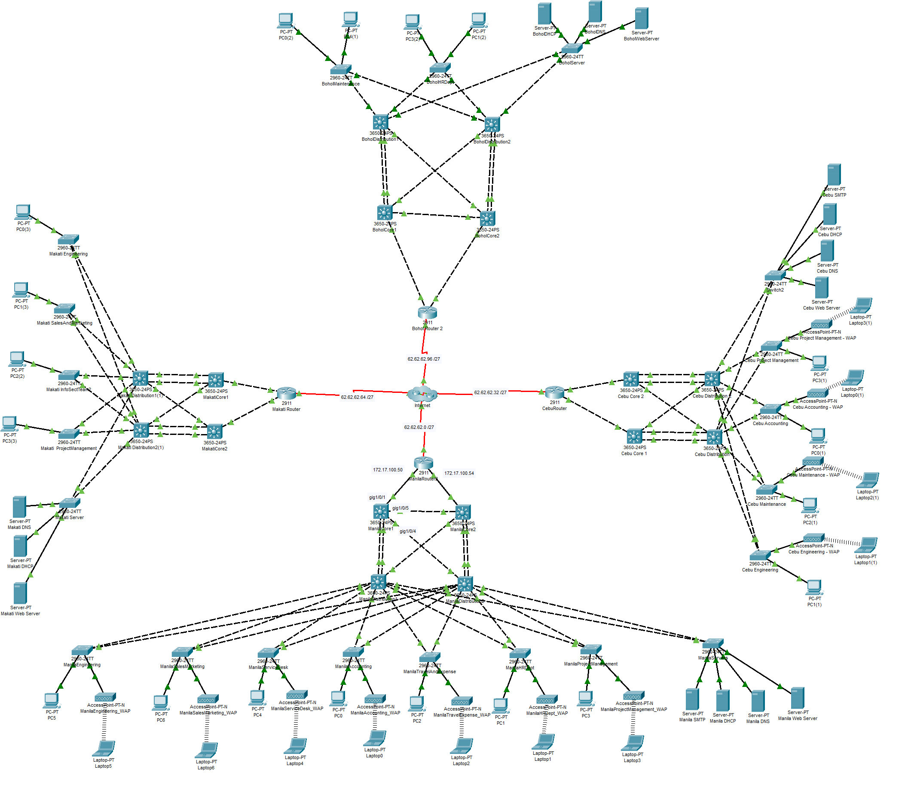
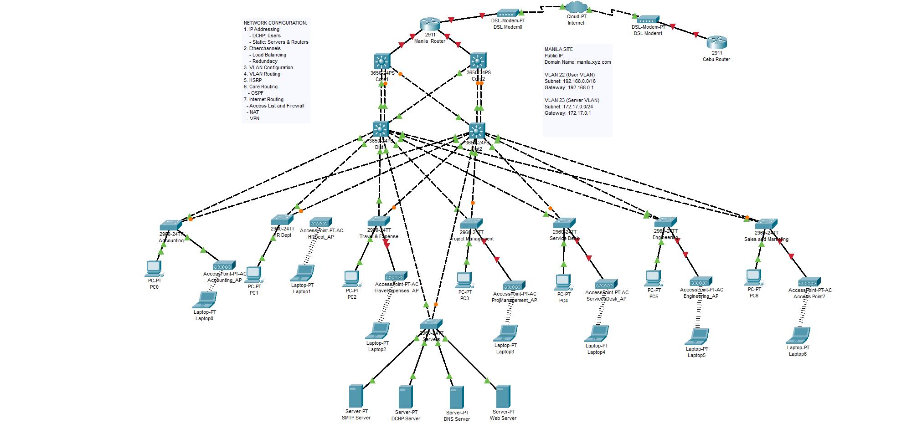

# XYZ Company: Multi-Site Enterprise Network Design

A comprehensive network infrastructure design and configuration for a Philippine-based logistics firm, simulated using **Cisco Packet Tracer**. This project implements a redundant Three-Layer Hierarchical Model across four geographic sites: Manila, Cebu, Bohol, and Makati.

## Network Architecture
The design follows the **Cisco Three-Layer Model** (Core, Distribution, Access) to ensure scalability and high availability.

## Visual Overview

### Main Topology
> This view shows the enterprise backbone connecting all four regional offices.


### Manila Site Infrastructure
> A deep dive into the HQ site featuring HSRP redundancy and the server farm.


### Key Features
* **Redundancy (HSRP):** Implemented High Availability at the Distribution layer in Manila to ensure gateway redundancy for User and Server VLANs.
* **Inter-Site Connectivity (VPN):** Secure **IPsec Site-to-Site VPN** tunnels connecting regional offices (e.g., Manila-Bohol and Makati-Cebu).
* **Scalable Addressing (VLSM):** Efficient use of IPv4 space using Variable Length Subnet Masking for over 1,500 users across various departments.
* **Dynamic Routing (OSPF):** Configured OSPF Area 0 for automated route propagation across the enterprise backbone.
* **Security & NAT:** Implemented **PAT (Port Address Translation)** for internet access and standard/extended ACLs for traffic control.

## Tech Stack & Protocols
- **Simulation Tool:** Cisco Packet Tracer
- **Routing:** OSPF, Static Routing, Inter-VLAN Routing (Router-on-a-Stick/Layer 3 Switching)
- **Switching:** VTP, VLANs, EtherChannel (LACP/PAgP), STP, HSRP
- **Security:** IPsec VPN, NAT/PAT, ACLs, Port Security
- **Services:** DHCP, DNS, HTTP (Web Servers), SMTP

## Site Overview
| Site | Focus | Key Services |
| :--- | :--- | :--- |
| **Manila** | Headquarters | Core Servers (DNS, DHCP, Web, SMTP), HSRP Redundancy |
| **Cebu** | Regional Hub | Engineering & Maintenance focus, NAT/PAT |
| **Makati** | Sales/InfoSec | High-security InfoSec Team VLAN, VPN to Cebu |
| **Bohol** | Operations | Maintenance & HR focus, VPN to Manila |

## Configuration Highlights

### HSRP — Gateway Redundancy (Manila HQ)
To ensure the 450+ Engineering users in Manila never lose connectivity, HSRP is configured between `MLA_DIST1` and `MLA_DIST2`. The active router handles traffic while the standby monitors for failure:
```bash
interface Vlan11
 ip address 192.168.0.254 255.255.254.0
 standby 11 ip 192.168.0.1
 standby 11 priority 105
 standby 11 preempt
```
`MLA_DIST1` holds priority 105 (active) for user VLANs, while `MLA_DIST2` takes priority 105 for server VLANs. Both use `preempt` to reclaim the active role after recovery.

### OSPF — Dynamic Routing
All core and distribution switches, plus site routers, participate in OSPF Area 0. This enables automatic route learning across the entire enterprise backbone:
```bash
router ospf 1
 log-adjacency-changes
 network 172.17.0.0 0.0.255.255 area 0
 network 192.168.0.0 0.0.255.255 area 0
 network 62.62.0.0 0.0.255.255 area 0
```

### IPsec VPN — Site-to-Site Tunnels
Each site router establishes encrypted tunnels to all other sites using AES-256, SHA-HMAC, and Diffie-Hellman Group 5. This ensures inter-site traffic is protected over the WAN:
```bash
crypto isakmp policy 1
 encr aes 256
 authentication pre-share
 group 5

crypto ipsec transform-set Cebu-Transform-Set esp-aes esp-sha-hmac

crypto map Cebu-VPN-MAP 1 ipsec-isakmp
 set peer 62.62.62.33
 set transform-set Cebu-Transform-Set
 match address 110
```
ACLs (110-112) on each router define which traffic is encrypted and routed through each tunnel.

## Network Addressing
The IP scheme uses four address blocks allocated via VLSM:

| Block | Purpose | Example |
| :--- | :--- | :--- |
| `192.168.0.0/16` | User VLANs | `192.168.0.0/23` — Manila Engineering (450 hosts) |
| `172.17.0.0/24` | Server VLANs | `172.17.0.0/28` — Manila Servers (14 hosts) |
| `172.17.100.0/24` | WAN /30 links | Core-to-Distribution point-to-point links |
| `62.62.62.0/24` | Internet-facing | NAT pools per site (`62.62.62.1–30` Manila) |

Full subnet breakdowns are in [`docs/VLSM.csv`](docs/VLSM.csv) and [`docs/IP Addresses.csv`](docs/IP%20Addresses.csv).

## Project Structure
```
├── assets/                          # Topology screenshots (PNG)
├── configs/                         # Cisco IOS startup-config files
│   ├── manila/                      # HQ — 12 devices (router, core, dist, access)
│   ├── cebu/                        # Regional hub — 9 devices
│   ├── makati/                      # Sales/InfoSec — 9 devices
│   └── bohol/                       # Operations — 7 devices
├── docs/
│   ├── Site Network Configuration Guide.md
│   ├── IP Addresses.csv
│   └── VLSM.csv
├── topology/
│   ├── MultiSiteTopology.pkt        # Main Packet Tracer file
│   └── initial-designs/             # Earlier topology iterations
└── README.md
```
Each site folder contains `core-layer/`, `distribution-layer/`, and `access-layer/` subdirectories with per-device config exports.

## Getting Started
1. **Open** `topology/MultiSiteTopology.pkt` in [Cisco Packet Tracer](https://www.netacad.com/courses/packet-tracer) 8.x+
2. **Switch to Simulation Mode** to trace packets between sites
3. **Verify connectivity** by pinging between end devices across sites

### Useful Verification Commands
```bash
show ip route                    # Verify OSPF-learned routes
show standby brief               # Check HSRP state and priority
show crypto isakmp sa            # Confirm VPN tunnel status
show ip nat translation          # Inspect NAT/PAT mappings
show etherchannel summary        # Verify LACP port-channels
show vlan brief                  # Confirm VLAN assignments
```

## Documentation
- [Site Network Configuration Guide](docs/Site%20Network%20Configuration%20Guide.md) — Step-by-step setup procedures for all protocols
- [VLSM Subnet Planning](docs/VLSM.csv) — Complete subnet allocations across all four sites
- [IP Address Table](docs/IP%20Addresses.csv) — Device-level IP assignments and interface mappings
